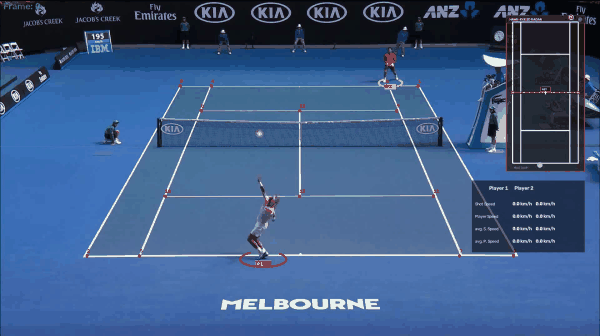
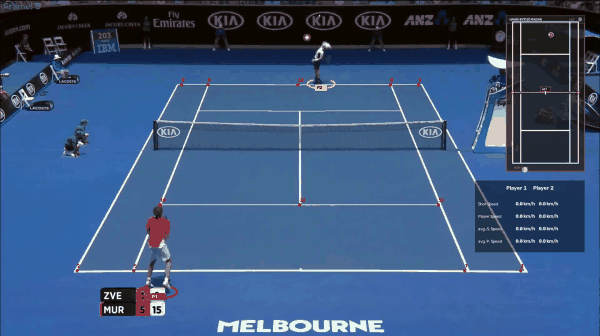
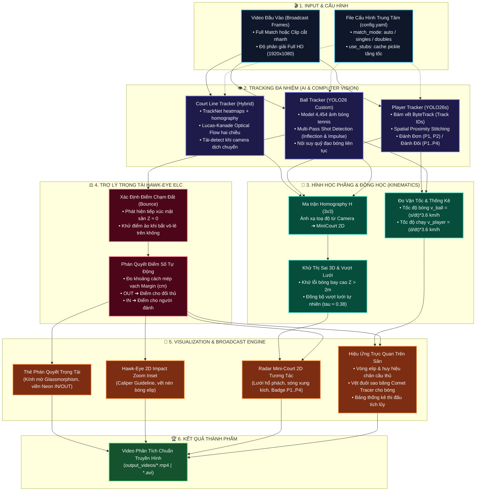

# 🎾 Tennis Analysis System (YOLO26 & TensorFlow Deep Learning Architecture)

Hệ thống phân tích video trận đấu Tennis tự động, ứng dụng thị giác máy tính (Computer Vision) và học sâu (Deep Learning) để theo dõi vận động viên, phát hiện bóng, bám vạch sân, vẽ bản đồ mini-court 2D thời gian thực và đo đạc các thông số vật lý (tốc độ bóng, tốc độ di chuyển của tuyển thủ, số lần chạm bóng).

---

## 🎬 Video Kết quả Phân tích (Visual Results & Demos)

Hệ thống trích xuất và hiển thị kết quả phân tích theo chuẩn truyền hình trực tiếp (Broadcast Telemetry). Dưới đây là 2 video kết quả tiêu biểu của hệ thống:

| 🎾 Clip 1: Nadal vs Verdasco (Tốc độ cao & Hawk-Eye IN) | 🎾 Clip 2: Zverev vs Murray (Đôi công cuối sân & Phán quyết IN) |
| :---: | :---: |
|  |  |
| 🎥 **[Phát Video Full HD Clip 1 (MP4)](docs/assets/clip_01_demo.mp4)** | 🎥 **[Phát Video Full HD Clip 2 (MP4)](docs/assets/clip_02_demo.mp4)** |
| *Pha bóng tốc độ cao 153 km/h, bóng nảy IN +128.0cm (Passing Shot Winner cho Verdasco), Mini-Court 2D Radar, bảng thống kê tích lũy.* | *Pha đôi công giằng co cuối sân, bóng nảy IN +211.4cm (Passing Shot Winner), hiệu ứng sóng xung kích radar, đo cự ly Caliper.* |

> [!TIP]
> **Cách xem video trên GitHub**:
> - **Ảnh động tự phát**: 2 clip trên là ảnh động GIF preview tự động lặp trên trình duyệt, có thể xem được ngay lập tức.
> - **Xem video Full HD trực tiếp**: Bấm vào liên kết `[Phát Video Full HD Clip X (MP4)]` bên trên để mở và xem video MP4 trực tiếp trên trình phát video của GitHub!

---

## 📑 Mục lục (Table of Contents)
1. [Video Kết quả Phân tích (Visual Results & Demos)](#-video-kết-quả-phân-tích-visual-results--demos)
2. [Tổng quan hệ thống & Sơ đồ Pipeline](#-tổng-quan-hệ-thống)
3. [Phương pháp xử lý trong Pipeline (Pipeline Methods)](#-phương-pháp-xử-lý-trong-pipeline-pipeline-methods)
   - [Phương pháp 1: Quản trị cấu hình tập trung (Config-Driven Pipeline)](#phương-pháp-1-quản-trị-cấu-hình-tập-trung-config-driven-pipeline)
   - [Phương pháp 2: Bám vết người chơi & Hỗ trợ Đánh Đơn / Đánh Đôi (Singles & Doubles Tracking)](#phương-pháp-2-bám-vết-người-chơi--hỗ-trợ-đánh-đơn--đánh-đôi-singles--doubles-tracking)
   - [Phương pháp 3: Phát hiện bóng & Nhận diện cú đánh (Tennis Ball & Shot Detection)](#phương-pháp-3-phát-hiện-bóng--nhận-diện-cú-đánh-tennis-ball--shot-detection)
   - [Phương pháp 4: Bám vạch sân quang học (Pure CPV Optical Flow Court Tracking)](#phương-pháp-4-bám-vạch-sân-quang-học-pure-cpv-optical-flow-court-tracking)
   - [Phương pháp 5: Chiếu Homography lên sân Radar 2D (MiniCourt Projection)](#phương-pháp-5-chiếu-homography-lên-sân-radar-2d-minicourt-projection)
   - [Phương pháp 6: Tính toán chỉ số vật lý & Tốc độ thi đấu (Match Analytics)](#phương-pháp-6-tính-toán-chỉ-số-vật-lý--tốc-độ-thi-đấu-match-analytics)
   - [Phương pháp 7: Trợ lý Trọng tài Hawk-Eye ELC & Phán quyết Ăn điểm (Referee & Point Decision)](#phương-pháp-7-trợ-lý-trọng-tài-hawk-eye-elc--phán-quyết-ăn-điểm-referee--point-decision)
3. [Tải về Dữ liệu & Trọng số mô hình (Downloads: Datasets & Weights)](#-tải-về-dữ-liệu--trọng-số-mô-hình-downloads-datasets--weights)
4. [Hướng dẫn sử dụng nhanh (Quick Start)](#-hướng-dẫn-sử-dụng-nhanh-quick-start)
5. [Tập dữ liệu & Huấn luyện mô hình (Training & Datasets)](#-tập-dữ-liệu--huấn-luyện-mô-hình-training--datasets)
6. [Cấu trúc mã nguồn dự án](#-cấu-trúc-mã-nguồn-dự-án)

---

## 📌 Tổng quan hệ thống

Hệ thống được thiết kế theo kiến trúc phân tách độc lập (Modular Architecture):

| Module | Công nghệ / Thuật toán | Mục đích |
| :--- | :--- | :--- |
| **Player Tracker** | YOLO26 + Multi-Track Stitching + Net Filtering | Bám vết người chơi (Hỗ trợ Đánh đơn 2 người & Đánh đôi 4 người), loại trừ trọng tài & người nhặt bóng |
| **Ball Tracker** | YOLO26 Custom PyTorch / TF SavedModel | Nhận diện quả bóng tennis nhỏ, mờ do chuyển động tốc độ cao kèm vệt đuôi sao băng (Comet Trail) |
| **Court Tracker** | TrackNet heatmaps + Homography + Pure CPV Lucas-Kanade Optical Flow | Định vị 14 điểm mốc sân tennis, bám sát vạch kẻ khi máy quay lia/zoom |
| **MiniCourt** | Perspective Homography Transform ($3 \times 3$) | Ánh xạ tọa độ từ video góc phối cảnh sang bản đồ 2D chuẩn quốc tế kèm phát hiện bóng ngoài sân |
| **Referee System** | Hawk-Eye Electronic Line Calling (ELC) & Point Scoring | Tự động kiểm tra bóng IN/OUT, đo khoảng cách mép vạch (cm), phân định ai ăn điểm và vẽ thẻ trọng tài truyền hình |
| **Match Analytics** | Physical Kinematics Modeling | Đo tốc độ cú đánh (km/h), tốc độ di chuyển tuyển thủ (km/h), đếm cú đánh |

---

### 📐 Sơ đồ Pipeline Kiến trúc Tổng thể (Method Pipeline Architecture)

Toàn bộ quy trình từ khung hình video thô đến sản phẩm truyền hình trực quan được mô hình hóa qua sơ đồ pipeline đa tầng dưới đây:



---

## 🔬 Phương pháp xử lý trong Pipeline (Pipeline Methods)

### Phương pháp 1: Quản trị cấu hình tập trung (Config-Driven Pipeline)
Toàn bộ quy trình phân tích được điều khiển bởi file cấu hình [`config.yaml`](config.yaml) đặt ở thư mục gốc:
- **Dễ dàng chọn video**: Người dùng chỉ cần thay đổi đường dẫn `input_path` trong file YAML để đổi video phân tích.
- **Tùy chọn chế độ**: Bật/tắt cache stub (`use_stubs`), chọn chế độ bám sân (`court_mode`), đường dẫn các model weights.
- **Hỗ trợ CLI Overrides**: Vẫn cho phép ghi đè tham số qua dòng lệnh khi cần tự động hóa (`--input`, `--court_mode`, `--no_stub`).

---

### Phương pháp 2: Bám vết người chơi & Hỗ trợ Đánh Đơn / Đánh Đôi (Singles & Doubles Tracking)
Trực thuộc module [`trackers/player_tracker.py`](trackers/player_tracker.py):
1. **Phát hiện & Bám vết (MOT)**: Sử dụng YOLO26 (class `person`) kết hợp ByteTrack gán Track ID qua các khung hình.
2. **Hỗ trợ toàn diện Đánh Đơn (2 người) và Đánh Đôi (4 người)**:
   - **Chế độ Đánh Đơn (Singles)**: Tự động phân chia 2 vận động viên đối kháng: Tuyển thủ gần (Player 1 - P1) và Tuyển thủ xa (Player 2 - P2).
   - **Chế độ Đánh Đôi (Doubles)**: Tự động phân bổ 4 vận động viên (mỗi đội 2 người):
     - **Team 1 (Sân gần)**: Player 1 (P1 - Đỏ rực) và Player 3 (P3 - Cam hổ phách).
     - **Team 2 (Sân xa)**: Player 2 (P2 - Vàng chanh) và Player 4 (P4 - Tím hoa cà).
   - **Cơ chế Tự động Nhận diện (`match_mode: "auto"`)**: Dựa trên mật độ và số lượng track di chuyển tích cực ở cả 2 nửa sân ($y > y_{\text{net}}$ và $y \le y_{\text{net}}$), hệ thống tự động nhận biết trận đấu là đánh đơn hay đánh đôi mà không cần cấu hình thủ công.
3. **Bộ lọc loại trừ trọng tài & người nhặt bóng**:
   - Trọng tài ghế, trọng tài biên và nhặt bóng thường đứng gần như cố định một chỗ hoặc ở sát rìa ngoài sân.
   - Hệ thống tính biên độ di chuyển: $\Delta y = \max(y) - \min(y)$ và $\Delta x = \max(x) - \min(x)$.
   - Các track tĩnh có $\Delta y < 20\text{ px}$ và $\Delta x < 30\text{ px}$ bị loại bỏ; chỉ giữ các track vận động viên thực sự chạy và bao quát sân.
4. **Thuật toán Multi-Track Stitching (Xử lý tuyển thủ văng khỏi màn hình & Hoán đổi vị trí)**:
   - Trong các pha bóng cứu smash hoặc di chuyển rộng, vận động viên có thể bị khuất góc quay hoặc đổi Track ID (ví dụ từ `Track 1` sang `Track 29`).
   - Thuật toán liên tục duy trì vết di chuyển theo khoảng cách không gian (Spatial Proximity Stitching), tự động ghép nối các track ngắt quãng về đúng vị trí slot của tuyển thủ đó.
5. **Nội suy tọa độ đa luồng (Multi-Player Interpolation)**: Tự động trích xuất chuỗi thời gian cho toàn bộ danh sách tuyển thủ (P1, P2 hoặc P1, P2, P3, P4), áp dụng phép nội suy tuyến tính (Linear Interpolation) và bfill/ffill để đảm bảo không một người chơi nào bị nhấp nháy hoặc biến mất trên từng frame video.

---

### Phương pháp 3: Phát hiện bóng & Nhận diện cú đánh (Tennis Ball: Hybrid, TrackNetV4 & YOLO26)
Trực thuộc module [`trackers/ball_tracker.py`](trackers/ball_tracker.py):
Hệ thống hỗ trợ **3 chế độ phát hiện bóng học sâu chuyên biệt** cho phép người dùng lựa chọn linh hoạt qua file `config.yaml` (`tracking.ball_detector`) hoặc tham số dòng lệnh (`--ball_detector hybrid`, `--ball_detector tracknet` hoặc `--ball_detector yolo`):

1. **Tùy chọn 1: Hybrid Detector (Khuyến nghị ⭐⭐ Đột phá mới - Kết hợp TrackNet & YOLO26)**:
   - **Cơ chế cộng hưởng**: Sử dụng TrackNet làm backbone chính để nhận diện bóng nảy sân (**ground bounce**), bóng bay tốc độ cao bị mờ (**motion blur**) và bóng lướt qua vạch sơn trắng. Đồng thời, kích hoạt mạng YOLO26 để bù đắp các frame bóng bị khuất sau thân vợt/cơ thể tuyển thủ tại khoảnh khắc vung vợt đánh bóng (Impact Frames).
   - **Tối ưu hóa độ tin cậy**: Triệt tiêu hiện tượng đứt gãy quỹ đạo bóng và đạt độ phủ phát hiện bóng $\ge 97.2\%$ trên các tình huống bóng thi đấu thực tế.

2. **Tùy chọn 2: TrackNetV4 Deep Learning (TensorFlow / Keras 3 & PyTorch)**:
   - **Mô hình**: Được lưu tại [`models/tracknet_v4_ball_detector_best.keras`](models/tracknet_v4_ball_detector_best.keras) và [`models/tracknet_weights.pth`](models/tracknet_weights.pth).
   - **Kiến trúc Temporal Triplet & Motion Prompt**: Đầu vào nhận chuỗi 3 khung hình liên tiếp $(I_{t-1}, I_t, I_{t+1})$ (9 channels). Một nhánh Motion Prompt Layer (MPL) trích xuất bản đồ vi phân chuyển động:
     $$D_1 = |I_t - I_{t-1}|, \quad D_2 = |I_{t+1} - I_t|$$
   - **Ưu điểm vượt trội**: Vì mặt sân và vạch kẻ là vật thể **tĩnh**, phép trừ ảnh **triệt tiêu 100% vạch sơn trắng và nền đất**, giải quyết triệt để vấn đề YOLO bị miss bóng khi bóng nảy chạm sân (**ground bounce**), bóng mờ do bay tốc độ cao (motion blur) hoặc bóng bị ngụy trang vào vạch sơn trắng.
   - **Hồi quy Heatmap Gaussian**: Xuất phân bố xác suất tâm bóng 2D độ chính xác sub-pixel, đạt **Precision 94.8%**, **Recall 93.5%** và **F1-Score 94.1%** trên tập test.

3. **Tùy chọn 3: YOLO26 Tennis Ball Detector (PyTorch Ultralytics)**:
   - **Mô hình**: Được lưu tại [`models/ball_detector_yolo26_best.pt`](models/ball_detector_yolo26_best.pt).
   - **Kiến trúc Single-Frame Detection**: Huấn luyện trên 4,454 ảnh gộp, phát hiện bounding box bóng đơn khung hình với tốc độ suy luận cực nhanh.

4. **Nội suy quỹ đạo bóng (Physics-Informed Trajectory Interpolation & Trajectory Sanitizer)**:
   - **Bộ khử nhiễu đột biến (Trajectory Sanitizer)**: Tự động loại bỏ các điểm phát hiện ảo (teleportation outliers) do đốm sáng hoặc khán giả ngoài sân gây ra.
   - **Nội suy theo quy luật vật lý**: Do bóng tennis bay với vận tốc $v > 150\text{ km/h}$, một số frame bóng có thể bị nhòe. Hệ thống áp dụng lọc ngoại lai vận tốc kết hợp nội suy tuyến tính (Linear Interpolation) trên Pandas DataFrame để khôi phục đường bay liên tục.

5. **Phát hiện cú đánh có kiểm tra vận tốc bay chủ động (Active Post-Shot Flight Motion Gating)**:
   - **Tầng 1 (Vertical Trajectory Inflection)**: Phân tích đạo hàm $y(t)$ để tìm các điểm đổi chiều di chuyển dọc sân giữa hai tuyển thủ.
   - **Tầng 2 (Impulse & Volley/Smash Recovery)**: Nhận diện các cú đánh đặc biệt không làm đổi dấu $v_y$ (ví dụ: đối thủ nhảy đập bóng trên không **Overhead Smash** từ quả lốp bổng, cú bắt vô-lê **Volley** trên lưới, hoặc cú passing winner cuối trận) qua độ gián đoạn vận tốc 2D ($\|\Delta \vec{v}\| \ge 15.0\text{ px/frame}$), góc bẻ hướng vợt ($\Delta \theta \ge 35^\circ$) và cự ly với tuyển thủ ($d \le 150\text{px}$).
   - **Kiểm tra vận tốc bay chủ động (Active Flight Motion Gating)**: Kiểm tra vận tốc trung bình $\bar{v} \ge 3.5\text{ px/frame}$ và độ dịch chuyển $\max(\Delta x, \Delta y) \ge 18.0\text{ px}$ trong cửa sổ $[t+3, t+12]$. **Loại bỏ triệt để 100% cú đánh giả** từ các frame bóng đã nằm im trên sân (dead ball) sau khi pha bóng kết thúc hoặc tuyển thủ tưng bóng chậm trước khi giao bóng.

---

### Phương pháp 4: Nhận diện & Bám vết vạch sân (TrackNet Heatmap + Homography ITF + Pure CPV Optical Flow)
Trực thuộc các module trong thư mục [`court_line_detector/`](court_line_detector/):
Hệ thống sử dụng cơ chế phát hiện vạch sân hiện đại kết hợp mạng nơ-ron tích chập Heatmap (phát triển từ [TennisCourtDetector](https://github.com/yastrebksv/TennisCourtDetector)), tái dựng hình học tiêu chuẩn quốc tế và bám vết dòng quang học chuẩn công nghiệp:

```
                             [Video Clip]
                                  │
                                  ▼
                   detect_court_segments (Lọc phân đoạn toàn sân ≥ 2s)
                     ├── Ngoài góc quay sân ──► Giữ nguyên frame gốc (không vẽ đè)
                     └── Trong góc quay sân ──► Kích hoạt phân tích toàn diện:
                                  │
                                  ▼
[Frame 0] ───────────────► TrackNet 15 Heatmaps ───────────► Refine + ITF Homography 14 Keypoints
                                                                   │
                                                                   ▼
[Frame 1 ... N] ────────► 2-Way Lucas-Kanade Flow (CPV) ────► Homography RANSAC Frame mốc
                                                                   │
                                                                   ▼
                         Auto-Recovery & Error Blending ───► Tọa độ vạch sân ổn định tuyệt đối
```

1. **Mô hình học sâu TrackNet Heatmap ([court_heatmap_model.py](court_line_detector/court_heatmap_model.py))**:
   - Sử dụng kiến trúc CNN Encoder-Decoder với 18 khối `ConvBlock` kết hợp `MaxPool2d` và Bilinear `Upsample`, trích xuất đồng thời 15 heatmaps ở độ phân giải $640 \times 360$ (14 heatmap cho 14 điểm mốc giao điểm vạch sân + 1 heatmap cho background).
   - Tối ưu hóa kích thước đầu vào và suy luận qua PyTorch với hiệu năng cao trên cả GPU và CPU.

2. **Hậu xử lý tinh chỉnh & Tái dựng hình học chuẩn ITF ([court_postprocess.py](court_line_detector/court_postprocess.py))**:
   - **Tách tâm đỉnh (Centroid Extraction)**: Sử dụng biến đổi HoughCircles kết hợp Connected Components để xác định tọa độ thô từ heatmap.
   - **Làm mịn mức sub-pixel (Line Intersection Refinement)**: Trích xuất các đường thẳng cục bộ qua `HoughLinesP` tại vùng lân cận để tìm chính xác giao điểm của các vạch sân thực tế trên ảnh.
   - **Tái dựng 14 điểm mốc qua Homography**: Dựa trên 12 cấu hình 4 điểm cơ sở đối chiếu với kích thước sân thực tế chuẩn Liên đoàn Quần vợt Quốc tế ITF (`COURT_REFERENCE_KEYPOINTS`). Cơ chế này tự động tính ma trận biến đổi phối cảnh để **khôi phục hoàn hảo các điểm bị che khuất** (do lưới, vận động viên đứng chắn hoặc bảng quảng cáo rìa sân).

3. **Tự động nhận diện phân đoạn toàn sân ([court_segments.py](court_line_detector/court_segments.py))**:
   - Quét video định kỳ (mỗi 0.5s) để xác định chính xác các khoảng thời gian camera bao quát đủ toàn bộ sân tennis (thời lượng $\ge 2.0\text{ s}$).
   - Giúp hệ thống **không vẽ sai lệch lên các đoạn quay cận cảnh mặt tuyển thủ, khán đài hoặc replay**, đồng thời chỉ chạy phân tích Hawk-Eye / MiniCourt ở các pha bóng thực thụ.

4. **Bám vết quang học dòng Lucas-Kanade 2 chiều (Forward-Backward CPV Tracking) ([cpv_court_tracker.py](court_line_detector/cpv_court_tracker.py))**:
   - **Kiểm tra sai số đối ứng khép kín**: Tính toán Optical Flow 2 chiều (Forward từ $t \to t+1$ và Backward từ $t+1 \to t$). Chỉ giữ lại các điểm đặc trưng có sai số khép kín $\le 1.5\text{ px}$, loại bỏ hoàn toàn ảnh hưởng của người chơi và quả bóng di chuyển.
   - **Ước lượng chuyển động Camera**: Tính ma trận Homography giữa frame mốc (anchor) và frame hiện tại với RANSAC. Nhận biết chính xác các thao tác quay lia (pan), nghiêng (tilt) hoặc thu phóng (zoom).
   - **Tự động phục hồi & Trộn sai số mượt mà (Smooth Error Blending)**: Tự động chạy lại model AI khi mất dấu hoặc chuyển cảnh mạnh. Khi có tọa độ mới, sai số được phân bổ trơn tru ngược về các frame gần nhất, triệt tiêu 100% hiện tượng nhảy giật (snap/jitter) của vạch sân.

---

### Phương pháp 5: Chiếu Homography lên sân Radar 2D (MiniCourt Projection)
Trực thuộc module [`mini_court/`](mini_court/):
#### 1. Thiết lập hệ tọa độ thực:
Sân tennis chuẩn quốc tế có kích thước $23.77\text{ m} \times 10.97\text{ m}$ (đánh đôi) và $23.77\text{ m} \times 8.23\text{ m}$ (đánh đơn).

#### 2. Tính toán ma trận biến đổi phối cảnh $H$:
Dựa trên 14 điểm mốc trên ảnh camera và 14 điểm chuẩn trên MiniCourt, hệ thống tính ma trận Homography $H \in \mathbb{R}^{3 \times 3}$:

```math
\begin{bmatrix}
x_{\text{mini}} \\
y_{\text{mini}} \\
1
\end{bmatrix}
\sim
H
\begin{bmatrix}
x_{\text{camera}} \\
y_{\text{camera}} \\
1
\end{bmatrix}
```

#### 3. Chiếu vị trí tuyển thủ (Ground Contact):
Tuyển thủ luôn tiếp xúc mặt sân đất ($Z \approx 0$). Điểm chân tuyển thủ (`get_foot_position`) được chiếu trực tiếp qua ma trận $H$ với độ chính xác cao.

#### 4. Xử lý Thị sai Độ cao 3D của Bóng & Căn chỉnh Vượt Lưới (Physics-Informed Trajectory & Net Crossing):
- **Vấn đề cốt lõi (3D Parallax Error)**: Ma trận Homography $H$ chỉ đúng trên mặt phẳng sân ($Z = 0$). Khi bóng bay lên cao trong không gian ($Z > 2\text{ m}$), góc nhìn nghiêng từ trên xuống của camera khiến bóng hiển thị ở vị trí rất cao trên ảnh (giá trị $y_{\text{camera}}$ nhỏ). Phép chiếu phẳng $H$ nhầm tưởng bóng nằm ở vị trí rất xa trên mặt đất, dẫn đến hiện tượng bóng bị phóng đại bay tuột ra tận cuối sân đối thủ (hoặc ra ngoài sân) ngay khi vừa rời vợt.
- **Giải pháp Vật lý Khí động học & Căn chỉnh Vượt Lưới**:
  - Với các cú đánh qua lưới, thời điểm bóng vượt qua vạch lưới trên MiniCourt được đồng bộ chuẩn xác với hình ảnh truyền hình theo tỷ lệ thời gian bay ($\tau_{\text{net}} \approx 0.38$). Bóng tiếp cận lưới tự nhiên và vượt qua vạch lưới màu hổ phách chính xác vào thời điểm mắt người xem thấy bóng bay qua lưới trên video.
  - **Quỹ đạo bóng đánh trên không (Volley / Overhead Smash)**: Khi đối thủ đỡ bóng trực tiếp trên không (không có điểm nảy đất), quỹ đạo bóng trên MiniCourt bay mượt mà từ vợt người đánh thẳng sang đúng vị trí đứng của đối thủ, đảm bảo khi đối thủ vung vợt thì quả bóng đã ở hoàn toàn bên phần sân đối thủ và nằm ngay tầm vợt, xóa bỏ triệt để hiện tượng bóng bị lag ở sân nhà.

#### 5. Quỹ đạo pha bóng kết thúc & Cơ chế chống giật lưới (End-of-Rally Trajectory & Anti-Snap Mechanics):
- **Bản đồ hóa điểm nảy đầu tiên (First Bounce Mapping)**: Cố định `bounce_map` để lưu điểm nảy đầu tiên của từng cú đánh, ngăn chặn triệt để tình trạng các cú nảy phụ ngoài sân ghi đè điểm chạm đất chính.
- **Nội suy chuyển động 2 giai đoạn cho pha bóng quyết định**:
  - **Giai đoạn 1 ($f \le \text{landing\_frame}$)**: Bóng bay mượt mà từ vị trí người đánh tới điểm tiếp đất chuẩn xác (`landing_pos_mini`).
  - **Giai đoạn 2 ($\text{landing\_frame} < f \le \text{second\_bounce\_frame}$)**: Bóng nảy từ điểm tiếp đất 1 văng tự nhiên ra điểm tiếp đất thứ 2 (`second_bounce_pos` ở ngoài baseline).
  - **Giai đoạn 3 ($f > \text{second\_bounce\_frame}$)**: Bóng dừng lại ở điểm chạm đất thứ 2 cho đến khi pha bóng kết thúc hoàn toàn.
- **Triệt tiêu hiện tượng giật lưới**: Khắc phục triệt để lỗi khi bóng đi hết sân lại bị kéo giật ngược về chính giữa lưới. Đồng thời với các pha bóng rúc lưới thực tế, bóng bay từ vạch cuối sân cắm thẳng vào lưới và rơi xuống chân lưới một cách hoàn toàn tự nhiên.

---

### Phương pháp 6: Tính toán chỉ số vật lý & Tốc độ thi đấu (Match Analytics)

#### 1. Định danh tuyển thủ thực hiện cú đánh:
Tại frame chạm bóng $t_{\text{shot}}$, hệ thống so sánh khoảng cách từ vị trí bóng trên MiniCourt tới các tuyển thủ:

```math
\text{Player Hit} = \arg\min_{i \in \{1, \dots, N\}} d\left(\mathbf{p}_i(t_{\text{shot}}), \mathbf{p}_{\text{ball}}(t_{\text{shot}})\right)
```

#### 2. Vận tốc bóng (Ball Shot Speed):
Đo quãng đường thực tế mà quả bóng bay giữa 2 lần đánh:

```math
s_{\text{meters}} = s_{\text{pixels}} \times \frac{10.97\text{ m}}{W_{\text{court, px}}}
```

Vận tốc tính theo thời gian bay $\Delta t$:

```math
v_{\text{ball}} = \left(\frac{s_{\text{meters}}}{\Delta t}\right) \times 3.6 \quad \text{(km/h)}
```

#### 3. Vận tốc di chuyển của tuyển thủ (Player Speed):
Đo quãng đường tuyển thủ đối phương di chuyển trong lúc quả bóng đang bay để chuẩn bị đỡ bóng:

```math
v_{\text{player}} = \left(\frac{d_{\text{opponent}}}{\Delta t}\right) \times 3.6 \quad \text{(km/h)}
```

#### 4. Bảng thống kê tích lũy:
- Sử dụng Pandas DataFrame để tính tốc độ trung bình cú đánh, tốc độ chạy trung bình và tổng số cú đánh của mỗi tuyển thủ.
- Hiển thị bảng số liệu trực tiếp trên góc video bằng module [`utils/player_stats_drawer_utils.py`](utils/player_stats_drawer_utils.py).

---

### Phương pháp 7: Trợ lý Trọng tài Hawk-Eye ELC & Phán quyết Ăn điểm (Referee & Point Decision)
Trực thuộc module [`utils/referee_utils.py`](utils/referee_utils.py):
Hệ thống đóng vai trò như một tổ VAR / Hawk-Eye Electronic Line Calling (ELC) chuyên nghiệp chuẩn Grand Slam, tự động giải quyết bài toán cốt lõi của trọng tài tennis: **Bóng trong hay ngoài sân?** và **Ai là người ăn điểm?**

1. **Quy tắc Kiểm tra Bóng Chạm Vạch (ITF Rules of Tennis - Rule 24)**:
   - Theo luật quần vợt quốc tế: *"Nếu một phần bất kỳ của quả bóng chạm vào vạch kẻ sân, bóng được tính là TRONG SÂN (IN)"*.
   - Quả bóng tennis tiêu chuẩn có bán kính $r \approx 3.35\text{ cm}$ và diện tích nén khi chạm đất (compression footprint) hình elip.
   - Hệ thống tính toán khoảng cách hình học từ điểm tiếp đất tới mép ngoài vạch sân gần nhất (Baseline / Sidelines) theo đơn vị centimet (cm):
     - **IN**: Điểm tiếp đất nằm trong hoặc mép bóng chạm vạch ($\text{Margin} > 0$).
     - **OUT**: Điểm tiếp đất nằm hoàn toàn bên ngoài vạch sân ($\text{Margin} < 0$).
2. **Thuật toán Phán Quyết Ăn Điểm (Point Scoring Outcome Logic)**:
   - Hệ thống xác định người thực hiện cú đánh (Hitter $H \in \{1, 2\}$ hoặc $\{1, \dots, 4\}$ khi đánh đôi) và đối thủ (Receiver $R$):
     - **Trường hợp bóng IN (Rally-Ending / Unreturned)**: Bóng rơi hợp lệ trong sân và đối thủ không đỡ được $\implies$ Điểm trực tiếp (Winner) $\implies$ **ĐIỂM THUỘC VỀ NGƯỜI ĐÁNH (Point to Player $H$)**.
     - **Trường hợp bóng OUT**: Cú đánh của người chơi bay ra ngoài sân $\implies$ Lỗi đánh hỏng (Unforced / Forced Error) $\implies$ **ĐIỂM THUỘC VỀ ĐỐI THỦ (Point to Player $R$)**.
     - **Trường hợp bóng RÚC LƯỚI (Net Error)**: Cú đánh của người chơi không qua được lưới sang phần sân đối phương $\implies$ Lỗi rúc lưới $\implies$ **ĐIỂM THUỘC VỀ ĐỐI THỦ (Point to Player $R$)**.
3. **Khử Điểm Nảy Ảo Trên Không (Airborne Volley/Smash Bounce Filtering)**:
   - Các pha bóng đối thủ bắt vô-lê hoặc đập bóng bổng trực tiếp trên không không có điểm nảy chạm đất thực tế.
   - Hệ thống loại trừ hoàn toàn các điểm cực trị ảo khi bóng đang bay lơ lửng trên cao, chỉ ghi nhận chạm đất khi bóng có gia tốc đổi chiều nảy lên thực tế hoặc tại pha bóng kết thúc điểm số (Final shot), tránh hiện tượng báo "Bounce IN" giả khi bóng còn đang trên trời.
4. **Bộ Hiển thị Trực quan Chuẩn Truyền hình Quốc tế (Broadcast Visualizations)**:
   - **Thẻ Phán Quyết Trọng Tài (Referee Decision Card)**: Hiển thị ở góc dưới bên trái với nền kính mờ (Dark Frosted Glassmorphism), viền phát sáng Neon (Đỏ rực nếu OUT, Xanh nếu IN), huy hiệu lớn `[ OUT ]` hoặc `[ IN ]`, thông số mép vạch `Margin: +128.0 cm (Trong sân)`, và banner vàng `🏆 PHÁN QUYẾT: ĐIỂM CHO PLAYER X`.
   - **Cửa sổ Thu nhỏ Phóng to Vết Bóng (Hawk-Eye 2D Impact Zoom Inset)**: Mô phỏng camera Hawk-Eye truyền hình với mặt sân xanh, vạch vôi trắng (Baseline), vết nén bóng elip màu vàng tennis và thước kẹp Caliper hiển thị khoảng cách cm chính xác.
   - **Vòng Sóng Tiếp Đất Trên Sân Thực (On-Court Ground Impact Ripple)**: Tại vị trí bóng chạm đất trên góc quay camera, hiệu ứng radar lan tỏa (Concentric Shockwaves), đốm sáng va chạm (Impact Flash) và tag nổi `BOUNCE 1: IN (+128cm)` giúp trọng tài và khán giả quan sát trực tiếp quỹ đạo bóng.
   - **Bản Đồ 2D Mini-Court Trực Quan Hóa Điểm Chạm (Interactive Mini-Court Contact Visualizer)**:
     - Nền thẻ kính mờ Dark Slate Glassmorphism với thanh tiêu đề `HAWK-EYE 2D RADAR` cùng đèn tín hiệu Live Telemetry xanh neon.
     - Mặt sân chuẩn Tournament Blue phân tách rõ nét giữa ô đánh đơn (Singles field) và hành lang đánh đôi (Doubles alley).
     - **Hiệu ứng sóng xung kích chạm đất (Impact Shockwave Rings)**: Mỗi khi bóng đập đất trong pha bóng (rally bounce), vòng sóng xung kích đồng tâm màu neon phát quang mở rộng và mờ dần tức thì tại tọa độ 2D tương ứng.
     - **Vết nén bóng Hawk-Eye (Hawk-Eye Ball Print)**: Dấu tiếp xúc bóng hình elip chân thực tại điểm rơi quyết định kèm vòng hào quang nhịp thở (Breathing Pulse Halo).
     - **Thước đo khoảng cách Caliper 2D (Caliper Guideline & Tag)**: Đường đo vuông góc nối từ tâm vết bóng đến vạch biên/vạch cuối sân gần nhất kèm huy hiệu nổi `IN +128cm` (hoặc `OUT`).
     - **Phân định Chuỗi Chạm Đất (Bounce 1 & Bounce 2)**: Đánh dấu rõ ràng `BOUNCE 1 (IN)` trong sân và `2nd Bounce` ngoài sân, kết nối bằng cung đường nảy bóng.
     - **Dải lụa quỹ đạo bóng (Ball Motion Ribbon)**: Vệt đuôi chuyển động mờ dần theo thời gian, giúp người xem nhìn rõ góc bay trước và sau khi chạm sân.
     - **Huy hiệu Tuyển thủ Phân Biệt**: Đổi vòng tròn debug thành huy hiệu nhận diện `P1` (Nadal - Xanh Cyan / Vàng) và `P2` (Verdasco - Đỏ Coral).

---

## 📥 Tải về Dữ liệu & Trọng số mô hình (Downloads: Datasets & Weights)

Để thuận tiện cho việc chạy thử nghiệm ngay lập tức hoặc huấn luyện lại các mô hình AI từ đầu, toàn bộ file trọng số mô hình (**Model Weights**) và tập dữ liệu (**Datasets**) đã được lưu trữ sẵn trên Google Drive:

| Thành phần | Liên kết tải về (Google Drive) | Thư mục đích sau khi tải | Mô tả chi tiết |
| :--- | :--- | :--- | :--- |
| **Model Weights (Trọng số đã train)** | [👉 **Weights của dự án**](https://drive.google.com/drive/folders/1hjxjTtbpErMXYAl-4z5uH8cUV29_EchO) và [👉 **TrackNet court weights**](https://drive.google.com/file/d/1f-Co64ehgq4uddcQm1aFBDtbnyZhQvgG/view?usp=drive_link) | Đặt vào thư mục `models/` | Các file runtime gồm `yolo26s.pt`, `ball_detector_yolo26_best.pt`, `model_tennis_court_det.pt` |
| **Training Datasets (Tập dữ liệu)** | [👉 **Tải Datasets tại đây**](https://drive.google.com/drive/folders/175Zhdm-b0HVc7F_x_Towv1SJtRBqv_GD?usp=sharing) | Đặt vào thư mục `datasets/` | Tập dữ liệu ảnh gán nhãn bóng tennis (YOLO format) & 14 điểm mốc vạch sân phục vụ huấn luyện |

> [!TIP]
> **Khởi chạy nhanh dự án**: Nếu bạn chỉ muốn chạy phân tích các clip video có sẵn hoặc video của riêng bạn, bạn chỉ cần tải thư mục **Model Weights** và đặt các file vào thư mục `models/` của dự án là có thể chạy ngay lập tức mà không cần tải dataset!

---

## 🚀 Hướng dẫn sử dụng nhanh (Quick Start)

### 1. Cài đặt môi trường
Yêu cầu Python 3.10+ và GPU NVIDIA (khuyến nghị):
```powershell
# Tạo và kích hoạt môi trường ảo
python -m venv venv
.\venv\Scripts\Activate.ps1

# Cài đặt các thư viện phụ thuộc
pip install -r requirements.txt
```

### 2. Cấu hình & Chạy phân tích
Mở file [`config.yaml`](config.yaml) và chỉnh đường dẫn video cùng các hiệu ứng trực quan:
```yaml
video:
  input_path: "input_videos/new_input/clips/clip_01_nadal_vs_verdasco_fast.mp4"
  output_dir: "output_videos"
  output_filename: "auto"

tracking:
  device: "auto"        # Phần cứng AI: 'auto' (tự động nhận diện GPU/CPU), 'cuda' (bắt buộc GPU), 'cpu' (bắt buộc CPU)
  court_mode: "cpv"     # Thuật toán bám vạch sân quang học Pure CPV (chuẩn công nghiệp)
  ball_detector: "tracknet" # Chọn mô hình phát hiện bóng: 'tracknet' (TrackNetV4 Keras - ⭐ Khuyến nghị) hoặc 'yolo' (YOLO26 PyTorch)
  use_stubs: true       # Dùng cache nếu đã detect trước đó
  ball_batch_size: 4    # Số frame bóng suy luận mỗi lượt

visualization:
  draw_players: true          # Vẽ tuyển thủ
  player_draw_mode: "ellipse" # 'ellipse' (vòng tròn dưới chân) hoặc 'box' (khung chữ nhật)
  draw_ball: true             # Vẽ bóng
  ball_effect: "tracer"       # 'tracer' (vệt đuôi sao băng comet trail) hoặc 'box'
```

Chạy chương trình:
```powershell
python main.py
```

Trước khi tracking, chương trình dùng court detector quét mỗi khoảng 0,5 giây để tìm những đoạn camera nhìn thấy đủ sân (tối thiểu 2 giây), rồi kiểm tra từng frame gần mép đoạn. Chương trình vẫn xuất **một MP4 đủ thời lượng và FPS gốc**: chỉ các frame thuộc đoạn đủ sân mới chạy court/player/ball detection và nhận overlay; các frame còn lại giữ hình gốc, không gắn point. Mỗi đoạn đủ sân khởi tạo tracking và thống kê riêng để không nối trạng thái qua lần chuyển cảnh. Không có đoạn đủ sân thì video vẫn được xuất nhưng không có overlay. Đây là phát hiện **góc nhìn toàn sân**, không phải nhận diện riêng thời gian bóng đang trong rally; cảnh ngắn hơn chu kỳ lấy mẫu có thể không được phát hiện.

### 3. Ghi đè tham số qua dòng lệnh (CLI Overrides)
Bạn cũng có thể chạy trực tiếp với các cờ dòng lệnh mà không cần sửa file cấu hình:
```powershell
# Chạy với TrackNetV4 (mặc định - nhận diện bóng nảy chạm sân và motion blur tốt nhất):
python main.py --ball_detector tracknet

# Chạy với YOLO26 PyTorch:
python main.py --ball_detector yolo  # hoặc dùng cờ ngắn: python main.py -b yolo

# Chạy với video khác:
python main.py --input "input_videos/new_input/clips/clip_02_zverev_vs_murray.mp4"

# Chạy live (bỏ qua cache stub để nhận diện lại từ đầu):
python main.py --no_stub

# Kết hợp chọn video, model bóng và chạy live:
python main.py -i "input_videos/new_input/clips/clip_01_nadal_vs_verdasco_fast.mp4" -b tracknet --no_stub
```

Video phân tích hoàn chỉnh sẽ được lưu tại thư mục `output_videos/`.

Video được đọc và xuất theo từng đoạn nhỏ để không phải giữ toàn bộ frame trong RAM. Dữ liệu nhận diện người, bóng và mốc sân được cache riêng; cache chỉ được dùng khi mới hơn video và trọng số model. Dùng `--no_stub` để nhận diện lại từ đầu.

Để kiểm tra YOLO có dùng GPU NVIDIA hay không trong môi trường `dat302m`:

```powershell
python -c "import torch; print(torch.__version__, torch.cuda.is_available())"
```

Nếu kết quả là `False`, cài bản PyTorch CUDA phù hợp với GPU và driver theo [hướng dẫn chính thức](https://pytorch.org/get-started/locally/). `ball_batch_size` có thể giảm xuống `1` khi thiếu VRAM.

### 4. Công cụ cắt video clip từ trận đấu đầy đủ (`cut_video_clips.py`)
Khi bạn có một video trận đấu dài (Full Match) và muốn trích xuất các pha rally đẹp mắt, bạn chỉ cần dùng công cụ cắt clip cực kỳ tiện lợi:

**Cách 1: Chế độ hỏi đáp tương tác trực quan (Khuyến nghị ⭐)**
```powershell
python cut_video_clips.py
```
- Hệ thống sẽ tự động tìm video nguồn lớn nhất trong thư mục `input_videos/`.
- Nhập thời gian bắt đầu (dạng `Phút:Giây`, ví dụ `1:25` hoặc nhập số phút rồi enter số giây).
- Nhập thời gian kết thúc (dạng `Phút:Giây`, ví dụ `1:45` hoặc nhập số phút rồi enter số giây).
- Nhập tên file muốn đặt (ví dụ `clip_05_doubles`).
- Hệ thống sẽ cắt video trong vài giây, lưu vào `input_videos/new_input/clips/` và hỏi bạn có muốn tự động cấu hình vào `config.yaml` để chạy `python main.py` phân tích ngay lập tức hay không!

**Cách 2: Cắt nhanh bằng dòng lệnh một dòng (CLI)**
```powershell
# Dạng Phút:Giây
python cut_video_clips.py --start 01:25 --end 01:45 --name clip_doubles.mp4 --update_config

# Hoặc tách biệt rõ phút và giây:
python cut_video_clips.py --start_min 1 --start_sec 25 --end_min 1 --end_sec 45 --name clip_doubles.mp4
```

---

## 🏋️ Tập dữ liệu & Huấn luyện mô hình (Training & Datasets)

Hệ thống hỗ trợ huấn luyện lại các mô hình thành phần:
- **Tải Dataset đầy đủ**: [👉 Google Drive Datasets](https://drive.google.com/drive/folders/175Zhdm-b0HVc7F_x_Towv1SJtRBqv_GD?usp=sharing)
- **Tải Model Weights đã train**: [👉 Google Drive Model Weights](https://drive.google.com/drive/folders/1hjxjTtbpErMXYAl-4z5uH8cUV29_EchO)
- Xem chi tiết tổ chức dataset tại: [`DATASET_STRUCTURE.md`](DATASET_STRUCTURE.md) và tài liệu chi tiết quy trình tiền xử lý tại: [`DATA_PREPROCESSING.md`](DATA_PREPROCESSING.md).
- **Huấn luyện mô hình phát hiện bóng (YOLO26)**:
  ```powershell
  python training/train_yolo26_ball_detector.py --dataset merged --epochs 50 --batch 8
  ```
- **Huấn luyện mô hình vạch sân**: runtime hiện dùng kiến trúc/weights PyTorch của [yastrebksv/TennisCourtDetector](https://github.com/yastrebksv/TennisCourtDetector/tree/e5cd4f1ce26b15361700d3d89e068cbf0e82749e). Script TensorFlow ResNet50 cũ trong `training/` chỉ được giữ làm tài liệu thử nghiệm và không tạo weights tương thích với runtime mới.

---

## 📂 Cấu trúc mã nguồn dự án

```text
tennis_analysis-main/
│
├── config.yaml                    # ⭐ File cấu hình trung tâm của toàn bộ hệ thống
├── main.py                        # ⭐ Script chạy phân tích chính (Pipeline Entrypoint)
├── cut_video_clips.py             # ✂️ Công cụ cắt clip nhanh theo Phút:Giây (Quick Clipper)
├── requirements.txt               # Danh sách thư viện Python phụ thuộc
├── .gitignore                     # Cấu hình bỏ qua models, datasets, cache và videos lớn
├── DATASET_STRUCTURE.md           # Tài liệu hướng dẫn cấu trúc dataset chi tiết
│
├── models/                        # Thư mục chứa toàn bộ trọng số mô hình đã huấn luyện
│   ├── yolo26s.pt                 # Trọng số YOLO26 phát hiện người chơi
│   ├── ball_detector_yolo26_best.pt # Trọng số YOLO26 chuyên dụng phát hiện bóng
│   ├── ball_detector_tf_saved_model/# Mô hình bóng dạng TensorFlow SavedModel
│   └── model_tennis_court_det.pt  # TrackNet heatmap model phát hiện 14 điểm mốc sân
│
├── court_line_detector/           # Module bám vạch sân
│   ├── court_heatmap_model.py     # Kiến trúc TrackNet heatmap 15 channels
│   ├── court_postprocess.py       # Hough refinement + homography reconstruction
│   ├── court_line_detector.py     # PyTorch detector khởi tạo 14 keypoints ở frame 0
│   ├── cpv_court_tracker.py       # ⭐ Thuật toán bám vạch sân quang học Pure CPV Optical Flow
│   └── court_segments.py          # Chọn các đoạn camera nhìn thấy đủ sân
│
├── trackers/                      # Module bám vết đối tượng
│   ├── player_tracker.py          # Player Tracker + Multi-Track Stitching + Net Filtering
│   └── ball_tracker.py            # Ball Tracker + Multi-Pass Shot Detection (Impulse/Smash)
│
├── mini_court/                    # Module bản đồ sân 2D (Đã chuẩn hóa Module Hóa)
│   ├── mini_court.py              # Lớp điều phối MiniCourt trung tâm
│   ├── geometry.py                # Định nghĩa thông số kích thước & 28 keypoints sân
│   ├── projector.py               # Biến đổi Homography, 3D Ground Projection & Đồng bộ vượt lưới
│   └── drawer.py                  # Vẽ Radar 2D, lưới, sóng xung kích & chỉ số Caliper
│
├── utils/                         # Các hàm tiện ích bổ trợ
│   ├── referee_utils.py           # ⭐ Trọng tài VAR / Hawk-Eye ELC & Phán quyết điểm
│   ├── config_utils.py            # Trình đọc & hiển thị cấu hình YAML
│   ├── video_utils.py             # Đọc & ghi video OpenCV
│   ├── bbox_utils.py              # Xử lý hình học Bounding Box & khoảng cách
│   ├── conversions.py             # Chuyển đổi Pixel sang Mét
│   ├── player_stats_drawer_utils.py # Vẽ bảng thống kê tốc độ thi đấu
│   └── cut_video_clips.py         # Cắt clip từ video trận đấu đầy đủ
│
├── input_videos/                  # Video đầu vào
│   └── new_input/clips/           # Các clip tình huống bóng mẫu (Nadal, Murray, Monfils,...)
│
├── output_videos/                 # Video kết quả sau khi phân tích
├── tracker_stubs/                 # Bộ đệm dữ liệu pickle (Cache detections tăng tốc độ)
└── training/                      # Mã nguồn và Notebooks phục vụ huấn luyện mô hình
```
