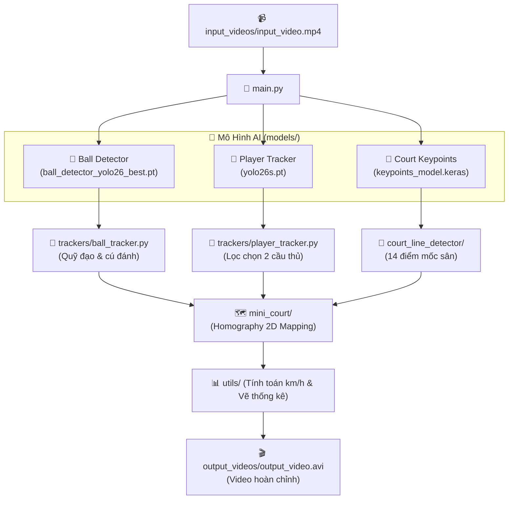

# 🎾 CẤU TRÚC THƯ MỤC DỰ ÁN TENNIS ANALYSIS (DIRECTORY STRUCTURE GUIDE)

Tài liệu này giải thích chi tiết ý nghĩa, vai trò và mối liên hệ giữa các thư mục, tập tin trong dự án **Phân Tích Trận Đấu Tennis Bằng Trí Tuệ Nhân Tạo (Computer Vision & Deep Learning)**.

---

## 🌳 SƠ ĐỒ CÂY THƯ MỤC TỔNG QUAN

```text
tennis_analysis-main/
│
├── 📂 analysis/                # Phân tích chuyên sâu dữ liệu & quỹ đạo trận đấu
├── 📂 constants/               # Hằng số kích thước chuẩn quốc tế của sân tennis (ITF)
├── 📂 court_line_detector/     # Module Deep Learning nhận diện 14 điểm mốc sân tennis
├── 📂 input_videos/            # Video trận đấu tennis đầu vào (chưa qua xử lý)
├── 📂 mini_court/              # Bản đồ 2D phối cảnh sân tennis thu nhỏ (Mini-Court)
├── 📂 models/                  # Kho lưu trữ các mô hình AI đã huấn luyện xong (Weights)
├── 📂 output_videos/           # Video thành phẩm xuất ra sau khi đã phân tích hoàn chỉnh
├── 📂 reports/                 # Toàn bộ biểu đồ đánh giá chất lượng mô hình (Loss, mAP, MAE)
├── 📂 runs/                    # Nhật ký và checkpoint tự động sinh ra trong lúc train YOLO
├── 📂 tracker_stubs/           # Bộ nhớ đệm (Cache) lưu tọa độ nhận diện qua từng khung hình
├── 📂 trackers/                # Module thuật toán theo dõi người chơi và quả bóng
├── 📂 training/                # Xưởng huấn luyện mô hình (Datasets, Notebooks, Scripts)
├── 📂 utils/                   # Các hàm tiện ích dùng chung (đọc video, vẽ bảng điểm, đổi km/h)
├── 📂 venv/                    # Môi trường ảo Python (Virtual Environment)
│
├── ⚙️ .env & .env.example      # Cấu hình biến môi trường & API Key
├── 🚫 .gitignore               # Danh sách file/thư mục loại trừ không đưa lên Git
├── 📄 DATASET_STRUCTURE.md     # Tài liệu chi tiết về cấu trúc các bộ dữ liệu bóng và sân
├── 🐍 main.py                  # File thực thi trung tâm nối toàn bộ hệ thống
├── 📄 README.md                # Tài liệu giới thiệu tổng quan dự án
├── 📄 README_STRUCTURE.md      # Tài liệu hướng dẫn ý nghĩa cây thư mục (File này)
├── 📋 requirements.txt         # Danh sách các thư viện Python yêu cầu
├── 🐍 yolo_inference.py        # Script test nhanh khả năng tracking của YOLO
└── 📦 yolo26s.pt               # Trọng số mô hình nền YOLO26 Small (nhận diện người chơi)
```

---

## 📖 GIẢI THÍCH CHI TIẾT TỪNG THƯ MỤC

### 1. 📂 `analysis/`
* **File chính:** `ball_analysis.ipynb`
* **Ý nghĩa:** Thư mục dùng để nghiên cứu sâu về toán học và vật lý của đường bóng:
  * Phân tích quỹ đạo bay của quả bóng trong không gian 2D/3D.
  * Thuật toán phát hiện sự đảo chiều quỹ đạo để xác định chính xác thời điểm vận động viên chạm bóng (shot hit detection).
  * Vẽ đồ thị phân bố các điểm rơi của bóng trên sân.

---

### 2. 📂 `constants/`
* **File chính:** `__init__.py`
* **Ý nghĩa:** Chứa các thông số kích thước hình học chuẩn của sân tennis theo quy chuẩn của **Liên đoàn Quần vợt Quốc tế (ITF)**:
  * Chiều dài sân: `23.77m`
  * Chiều rộng sân đánh đơn: `8.23m` | Chiều rộng sân đánh đôi: `10.97m`
  * Khoảng cách từ lưới đến vạch giao bóng: `6.40m`
* **Vai trò:** Dùng làm hệ quy chiếu thực tế để chuyển đổi khoảng cách pixel trên video thành khoảng cách mét thực, từ đó tính được vận tốc di chuyển và vận tốc đánh bóng (km/h).

---

### 3. 📂 `court_line_detector/`
* **File chính:** `court_line_detector.py`
* **Ý nghĩa:** Đóng gói lớp `CourtLineDetector` xây dựng trên kiến trúc **ResNet50 Regression (Keras 3)**:
  * Nhận vào khung hình sân tennis, chuẩn hóa theo kích thước `224x224`.
  * Dự đoán chính xác tọa độ $(x, y)$ của **14 điểm mốc (keypoints)** quan trọng trên sân (4 góc sân, các giao điểm vạch giao bóng, chân cột lưới).
  * Hỗ trợ tự động chạy trên GPU NVIDIA RTX 5060 thông qua backend PyTorch/CUDA.

---

### 4. 📂 `input_videos/`
* **File chính:** `input_video.mp4`, `image.png`
* **Ý nghĩa:** Nơi đặt các video trận đấu tennis thực tế đầu vào (thường là góc quay truyền thống từ sau lưng sân đấu - Broadcast Camera). Đây là dữ liệu thô ban đầu để pipeline [`main.py`](file:///d:/FPT/DAT301m/tennis_analysis-main/main.py) đọc và xử lý.

---

### 5. 📂 `mini_court/`
* **File chính:** `mini_court.py`
* **Ý nghĩa:** Mô phỏng **Bản đồ sân tennis 2D thu nhỏ (Top-Down Radar View)** đặt ở góc màn hình:
  * Ứng dụng thuật toán ma trận phối cảnh (**Perspective Transform / Homography Matrix**).
  * Chiếu tọa độ biến dạng quang học 3D của cầu thủ và quả bóng trên video thật thành tọa độ phẳng 2D chuẩn xác trên bản đồ thu nhỏ.
  * Giúp người xem có cái nhìn chiến thuật toàn cảnh về vị trí đứng và điểm rơi của bóng.

---

### 6. 📂 `models/`
* **Các file mô hình:**
  * `ball_detector_yolo26_best.pt`: Mô hình nhận diện bóng YOLO26 tối ưu nhất (mAP50 đạt **87.21%**).
  * `keypoints_model.keras` / `keypoints_model.h5`: Mô hình nhận diện 14 điểm mốc vạch sân ResNet50 (sai số MAE siêu nhỏ **~0.82 pixel**).
  * `ball_detector_yolo26_best.onnx`: Bản xuất định dạng ONNX đa nền tảng.
  * `ball_detector_tf_saved_model/`: Bản xuất định dạng TensorFlow SavedModel & TFLite (phục vụ môi trường di động/nhúng).
* **Ý nghĩa:** Kho lưu trữ "bộ não" của dự án. [`main.py`](file:///d:/FPT/DAT301m/tennis_analysis-main/main.py) sẽ trực tiếp nạp các trọng số tốt nhất từ đây để chạy phân tích.

---

### 7. 📂 `output_videos/`
* **File chính:** `output_video.avi`
* **Ý nghĩa:** Thư mục chứa video thành phẩm cuối cùng sau khi đã chạy xong phân tích. Video này đã được phủ đầy đủ các lớp thông tin:
  * Khung bao định danh người chơi (Player 1, Player 2).
  * Vệt quỹ đạo bám sát quả bóng.
  * 14 điểm mốc và các đường kẻ vạch sân tennis.
  * Bản đồ Mini-Court 2D hiển thị trực quan ở góc màn hình.
  * Bảng thống kê số lần đánh và tốc độ (km/h) cập nhật liên tục theo từng frame.

---

### 8. 📂 `reports/`
* **Các thư mục con:**
  * `ball_detector_plots/`: Biểu đồ huấn luyện mô hình bóng (Loss curves, mAP50, Precision, Recall, Ma trận nhầm lẫn Confusion Matrix, ảnh đối chiếu giai đoạn 100 epoch).
  * `court_detector_plots/`: Biểu đồ huấn luyện mô hình vạch sân (Loss MSE, MAE curves và ảnh dự đoán trực quan Ground Truth vs Prediction).
* **Ý nghĩa:** Kho lưu trữ tài liệu chứng minh khoa học cho bài tập lớn, đồ án môn học hoặc báo cáo kết quả trước hội đồng.

---

### 9. 📂 `runs/`
* **File chính:** `runs/detect/yolo26s_ball_detector/`
* **Ý nghĩa:** Thư mục do thư viện Ultralytics tự động sinh ra trong quá trình huấn luyện YOLO:
  * Chứa file `results.csv` lưu lịch sử huấn luyện qua từng epoch.
  * Chứa các ảnh kiểm tra trực quan nhãn dữ liệu (`train_batch*.jpg`, `val_batch*.jpg`).

---

### 10. 📂 `tracker_stubs/`
* **Các file đệm:** `player_detections.pkl`, `ball_detections.pkl`
* **Ý nghĩa:** **Bộ nhớ đệm (Cache)** lưu sẵn kết quả nhận diện của AI trên từng khung hình:
  * Giúp tăng tốc độ debug: Khi sửa đổi giao diện hoặc logic tính toán, hệ thống chỉ cần đọc dữ liệu từ file `.pkl` trong **0.01 giây** thay vì phải chạy lại AI tốn thời gian.
  * Có thể xóa thư mục này bất kỳ lúc nào để buộc hệ thống chạy AI quét lại từ đầu và tạo cache mới.

---

### 11. 📂 `trackers/`
* **File chính:**
  * `player_tracker.py`: Phát hiện và theo dõi chuyển động của người chơi; tự động lọc chọn đúng 2 vận động viên thi đấu trên sân, bỏ qua trọng tài và khán giả.
  * `ball_tracker.py`: Phát hiện bóng, thuật toán nội suy làm mượt vị trí các frame bóng bị khuất (`interpolate_ball_positions`) và tính toán thời điểm vung vợt đánh bóng (`get_ball_shot_frames`).
* **Ý nghĩa:** Chứa các giải thuật bám vết đối tượng (Object Tracking) cốt lõi của bài toán.

---

### 12. 📂 `training/`
* **Nội dung bên trong:**
  * `datasets/`: Chứa các bộ dữ liệu ảnh bóng gộp (`merged_tennis_dataset`) và bộ ảnh vạch sân 10,000 ảnh.
  * `tennis_ball_detector_training_yolo26.ipynb`: Notebook huấn luyện mô hình bóng trên GPU RTX 5060.
  * `tennis_court_keypoints_training_tf.ipynb`: Notebook huấn luyện mô hình điểm mốc sân Keras 3 trên GPU RTX 5060.
  * `train_yolo26_ball_detector.py` & `train_court_line_detector_tf.py`: Script chạy huấn luyện bằng dòng lệnh.
  * `dataset_downloader.py` & `download_court_dataset.py`: Công cụ tự động tải dataset từ Roboflow.
* **Ý nghĩa:** "Nhà máy" nghiên cứu và huấn luyện mô hình Deep Learning của dự án.

---

### 13. 📂 `utils/`
* **Các file chính:**
  * `video_utils.py`: Đọc từng khung hình video (`read_video`) và ghi danh sách khung hình thành file video xuất ra (`save_video`).
  * `bbox_utils.py`: Đo khoảng cách Euclidean giữa 2 điểm, tìm tọa độ tâm của bounding box.
  * `conversions.py`: Chuyển đổi khoảng cách từ pixel sang mét thực tế và chuyển m/s sang km/h.
  * `player_stats_drawer_utils.py`: Vẽ bảng thống kê trong suốt hiển thị vận tốc và thông số thi đấu ở góc khung hình.
* **Ý nghĩa:** Thư viện hàm phụ trợ (Utility functions) hỗ trợ cho pipeline chính.

---

### 14. 📂 `venv/`
* **Ý nghĩa:** Môi trường ảo Python (Virtual Environment). Chứa toàn bộ các gói thư viện Python đã cài đặt độc lập (PyTorch CUDA 13.0, Keras 3, Ultralytics, OpenCV, Pandas...). Thư mục này giúp dự án hoạt động ổn định và không ảnh hưởng đến hệ thống chung của máy tính.

---

## 📄 CÁC FILE QUAN TRỌNG Ở THƯ MỤC GỐC

| Tên File | Chức Năng & Ý Nghĩa |
| :--- | :--- |
| **`main.py`** | **Trọng tâm của dự án**: Tải các mô hình từ `models/`, đọc video từ `input_videos/`, chạy tracking, tính toán vận tốc, vẽ Mini-Court và xuất video ra `output_videos/`. |
| **`yolo26s.pt`** | Trọng số mô hình nền YOLO26 Small gốc, dùng cho bộ `PlayerTracker` nhận diện người chơi. |
| **`yolo_inference.py`** | Script nhỏ chạy thử nghiệm suy luận nhanh mô hình YOLO trên video. |
| **`requirements.txt`** | Danh sách tất cả các thư viện cần cài đặt để chạy mã nguồn. |
| **`DATASET_STRUCTURE.md`** | Hướng dẫn chi tiết về cấu trúc các tập dữ liệu huấn luyện. |
| **`README.md`** | Hướng dẫn tổng quan về dự án và các bước cài đặt chạy ứng dụng. |
| **`README_STRUCTURE.md`** | Tài liệu này - bản đồ giải thích cấu trúc toàn bộ dự án. |

---

## 🔄 LUỒNG DỮ LIỆU HOẠT ĐỘNG (PIPELINE DATA FLOW)


