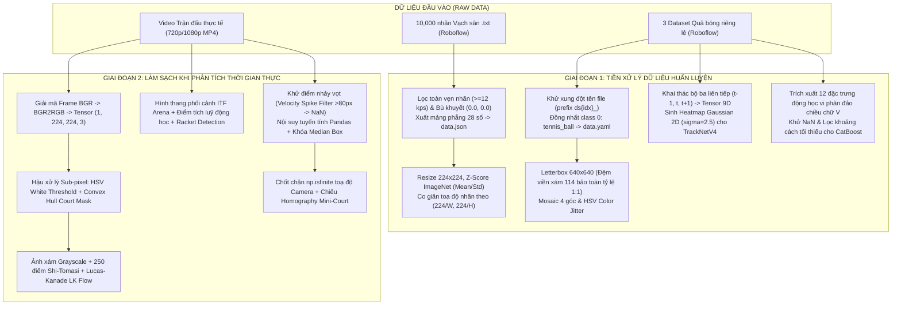

# 📊 BÁO CÁO TOÀN DIỆN: CÁC GIAI ĐOẠN LÀM SẠCH VÀ TIỀN XỬ LÝ DỮ LIỆU
## (DATA CLEANING AND PREPROCESSING COMPREHENSIVE REPORT)
### DỰ ÁN: HỆ THỐNG PHÂN TÍCH QUẦN VỢT THÔNG MINH (AI TENNIS ANALYSIS & HAWK-EYE SYSTEM)

> **Tài liệu tham chiếu mã nguồn trực quan:**
> - 📓 Notebook 1: [`reports/data_cleaning/01_tennis_ball_data_preprocessing.ipynb`](file:///d:/FPT/DAT301m/tennis_analysis-main/reports/data_cleaning/01_tennis_ball_data_preprocessing.ipynb) *(Khám phá EDA, gộp dataset bóng, thuật toán Letterbox $640 \times 640$, Mosaic & HSV Jitter)*
> - 📓 Notebook 2: [`reports/data_cleaning/02_tennis_court_keypoints_preprocessing.ipynb`](file:///d:/FPT/DAT301m/tennis_analysis-main/reports/data_cleaning/02_tennis_court_keypoints_preprocessing.ipynb) *(Khám phá EDA nhãn 10,000 ảnh sân, lọc nhãn $\ge 12$ keypoints, bù khuyết toạ độ, chuẩn hoá Tensor ResNet50 và hậu xử lý HSV Sub-pixel)*

---

## 📑 MỤC LỤC
1. [Tổng Quan & Thách Thức Dữ Liệu Trong Thị Giác Thể Thao](#1-tổng-quan--thách-thức-dữ-liệu-trong-thị-giác-thể-thao)
2. [Sơ Đồ Kiến Trúc Quy Trình Xử Lý Dữ Liệu Hai Giai Đoạn](#2-sơ-đồ-kiến-trúc-quy-trình-xử-lý-dữ-liệu-hai-giai-đoạn)
3. [Giai Đoạn 1: Làm Sạch và Tiền Xử Lý Dữ Liệu Huấn Luyện (Training Phase)](#3-giai-đoạn-1-làm-sạch-và-tiền-xử-lý-dữ-liệu-huấn-luyện-training-phase)
   - [3.1. Dữ liệu Quả bóng Tennis (Tennis Ball Dataset - YOLO26)](#31-dữ-liệu-quả-bóng-tennis-tennis-ball-dataset---yolo26)
   - [3.2. Dữ liệu Điểm mốc Vạch sân (Court Keypoints Dataset - ResNet50)](#32-dữ-liệu-điểm-mốc-vạch-sân-court-keypoints-dataset---resnet50)
   - [3.3. Dữ liệu Chuỗi Thời Gian Bộ Ba Khung Hình (Temporal Triplets - TrackNetV4)](#33-dữ-liệu-chuỗi-thời-gian-bộ-ba-khung-hình-temporal-triplets---tracknetv4)
   - [3.4. Dữ liệu Động Học Chạm Sân (Bounce Kinematics - CatBoost ELC)](#34-dữ-liệu-động-học-chạm-sân-bounce-kinematics---catboost-elc)
4. [Giai Đoạn 2: Làm Sạch và Tiền Xử Lý Trong Luồng Suy Luận Thời Gian Thực (Inference Phase)](#4-giai-đoạn-2-làm-sạch-và-tiền-xử-lý-trong-luồng-suy-luận-thời-gian-thực-inference-phase)
   - [4.1. Giải mã và Tiền xử lý Luồng Video (Video Ingestion)](#41-giải-mã-và-tiền-xử-lý-luồng-video-video-ingestion)
   - [4.2. Hậu Xử Lý Sub-pixel Tinh Chỉnh Vạch Sân (HSV Line Snapping)](#42-hậu-xử-lý-sub-pixel-tinh-chỉnh-vạch-sân-hsv-line-snapping)
   - [4.3. Tiền Xử Lý Bám Sân Quang Học Thuần Túy (Pure CPV Optical Flow)](#43-tiền-xử-lý-bám-sân-quang-học-thuần-túy-pure-cpv-optical-flow)
   - [4.4. Lọc Nhiễu và Xác Định Vận Động Viên (Perspective ITF Arena Gating & Kinetic Racket Fusion)](#44-lọc-nhiễu-và-xác-định-vận-động-viên-perspective-itf-arena-gating--kinetic-racket-fusion)
   - [4.5. Làm Sạch và Khôi Phục Quỹ Đạo Bóng (Trajectory Cleaning & Linear Interpolation)](#45-làm-sạch-và-khôi-phục-quỹ-đạo-bóng-trajectory-cleaning--linear-interpolation)
   - [4.6. Kiểm Tra Hợp Lệ Trọng Tài Điện Tử (Referee np.isfinite Guards & Mini-Court Homography)](#46-kiểm-tra-hợp-lệ-trọng-tài-điện-tử-referee-npisfinite-guards--mini-court-homography)
5. [Bảng Ma Trận Tổng Hợp Toàn Bộ Quy Trình](#5-bảng-ma-trận-tổng-hợp-toàn-bộ-quy-trình)
6. [Đánh Giá Hiệu Quả và Kết Luận](#6-đánh-giá-hiệu-quả-và-kết-luận)

---

## 1. TỔNG QUAN & THÁCH THỨC DỮ LIỆU TRONG THỊ GIÁC THỂ THAO

Trong các hệ thống phân tích thể thao đỉnh cao, dữ liệu video trận đấu tennis thực tế đặt ra những thách thức kỹ thuật vô cùng khắc nghiệt đối với các mô hình học máy:

1. **Vật thể mục tiêu (Quả bóng) siêu nhỏ và biến dạng động học:**
   - Qua phân tích định lượng EDA trong notebook [`01_tennis_ball_data_preprocessing.ipynb`](file:///d:/FPT/DAT301m/tennis_analysis-main/reports/data_cleaning/01_tennis_ball_data_preprocessing.ipynb), diện tích trung bình của một hộp bao (Bounding Box) quả bóng chỉ chiếm **$0.012\%$ diện tích ảnh** (kích thước trung vị $10 \times 10$ pixels trong ảnh $1280 \times 720$).
   - Vận tốc bóng có thể vượt mốc $200\text{ km/h}$, gây ra hiện tượng **Motion Blur (vệt mờ chuyển động)** khiến quả bóng bị kéo dài, hòa lẫn vào nền sân hoặc biến mất khỏi khung hình trong $1 \to 3$ frames liên tiếp.
2. **Nhiễu bối cảnh và tỷ lệ khung hình:**
   - Màu xanh neon/vàng chanh của bóng rất dễ bị AI phát hiện nhầm (False Positives) với vệt sơn trắng, đế giày vận động viên, logo tài trợ hoặc trang phục khán giả.
   - Nếu co giãn ảnh đầu vào thông thường (Stretch Resizing), quả bóng hình cầu hoàn hảo ($1:1$) sẽ bị bóp dẹt thành hình elip, phá vỡ đặc trưng hình học học được bởi mạng tích chập.
3. **Sự dịch chuyển góc quay (Camera Pan/Tilt/Zoom):**
   - Vạch sân thay đổi toạ độ liên tục khi camera lia theo tuyển thủ. Mạng nơ-ron hồi quy toạ độ vạch sân ResNet50 có sai số thô $\pm 3\text{ pixels}$, nếu không được làm sạch và tinh chỉnh dưới mức pixel (Sub-pixel refinement), sai số khi chiếu lên mặt sân thực tế sẽ lên tới hàng chục centimet, làm sai lệch kết quả phán quyết IN/OUT của trọng tài.
4. **Hỗn tạp đối tượng người trong sân:**
   - Trong một khung hình thường có từ 5 đến 10 người: 2 tay vợt, 1 trọng tài chính ngồi trên ghế cao, các trọng tài biên đứng quanh vạch biên và các cô/cậu bé nhặt bóng (ball boys). Tuyển thủ lại thường xuyên chạy ra ngoài vạch biên sân để cứu bóng.

Do đó, **làm sạch và tiền xử lý dữ liệu** là chìa khóa then chốt quyết định tính chính xác và độ ổn định của toàn bộ hệ thống.

---

## 2. SƠ ĐỒ KIẾN TRÚC QUY TRÌNH XỬ LÝ DỮ LIỆU HAI GIAI ĐOẠN



---

## 3. GIAI ĐOẠN 1: LÀM SẠCH VÀ TIỀN XỬ LÝ DỮ LIỆU HUẤN LUYỆN (TRAINING PHASE)

### 3.1. Dữ liệu Quả bóng Tennis (Tennis Ball Dataset - YOLO26)
* **File tài liệu & mã nguồn trực quan:** [`reports/data_cleaning/01_tennis_ball_data_preprocessing.ipynb`](file:///d:/FPT/DAT301m/tennis_analysis-main/reports/data_cleaning/01_tennis_ball_data_preprocessing.ipynb)
* **File thực thi hệ thống:** [`training/dataset_downloader.py`](file:///d:/FPT/DAT301m/tennis_analysis-main/training/dataset_downloader.py) và [`training/train_yolo26_ball_detector.py`](file:///d:/FPT/DAT301m/tennis_analysis-main/training/train_yolo26_ball_detector.py).

#### 📊 1. Phân tích Khám phá Dữ liệu (EDA) & Vấn đề dữ liệu thô:
Dữ liệu được thu thập từ 3 tập nguồn Roboflow độc lập:
1. `dataset_1_tennis_ball`: $577$ ảnh, $577$ nhãn.
2. `dataset_2_ball_detection`: $2,370$ ảnh, $2,370$ nhãn.
3. `dataset_3_me_tennis`: $1,507$ ảnh, $1,473$ nhãn.

**Thống kê đặc trưng Bounding Box từ Notebook 1:**
- Phân tích trên $3,456$ nhãn tập huấn luyện:
  - Chiều rộng trung vị: $10.2\text{ px}$ (chiếm $0.80\%$ chiều rộng ảnh).
  - Chiều cao trung vị: $9.8\text{ px}$ (chiếm $1.36\%$ chiều cao ảnh).
  - Diện tích BBox trung vị: $104.5\text{ px}^2$ ($\approx 0.011\%$ diện tích khung hình Full HD).
  - Tỷ lệ khung hình (Aspect Ratio $W/H$): tập trung xung quanh $1.04$ (xác nhận quả bóng có hình thái hình cầu đối xứng).

#### 🛠️ 2. Quy trình Hợp nhất & Làm sạch nhãn:
* **Khử xung đột tên file (Prefixing):** Do các bộ dữ liệu có tên file trùng nhau (như `frame_001.jpg`), hệ thống tự động thêm tiền tố chỉ số nguồn:
  ```python
  # Trích xuất logic từ dataset_downloader.py & Notebook 1
  new_stem = f"ds{ds_idx}_{orig_stem}"
  # Ví dụ: ds0_frame_01.jpg, ds1_frame_01.jpg, ds2_frame_01.jpg
  ```
* **Đồng nhất hóa lớp đối tượng (Class Unification):** Một số bộ dữ liệu có gán lẫn người hoặc vợt với class ID khác nhau. Hệ thống lọc và ép toàn bộ về một lớp duy nhất:
  ```yaml
  # File cấu hình training/datasets/ball/merged_tennis_dataset/data.yaml
  path: d:/FPT/DAT301m/tennis_analysis-main/training/datasets/ball/merged_tennis_dataset
  train: train/images
  val: valid/images
  test: test/images
  names:
    0: tennis_ball
  ```
* **Thống kê bộ dữ liệu chuẩn hóa sau khi làm sạch:**
  | Phân vùng (Split) | Số lượng ảnh (Images) | Số lượng file nhãn (Labels) | Tỷ lệ |
  | :--- | :---: | :---: | :---: |
  | **TRAIN** | $3,572$ | $3,546$ | $80.2\%$ |
  | **VALID** | $588$ | $581$ | $13.2\%$ |
  | **TEST** | $294$ | $293$ | $6.6\%$ |
  | **TỔNG CỘNG** | **4,454** | **4,420** | **100%** |

#### 🖼️ 3. Tiền xử lý Letterbox Resizing $640 \times 640$ (Bảo toàn tỷ lệ 1:1):
Thay vì co giãn ép khung gây dẹt quả bóng, thuật toán Letterbox tính toán hệ số co giãn đồng nhất theo cạnh dài nhất và bù viền đệm xám (giá trị `114`):
```python
def letterbox_image(image, target_size=(640, 640), pad_color=(114, 114, 114)):
    ih, iw = image.shape[:2]
    tw, th = target_size
    scale = min(tw / iw, th / ih)
    nw, nh = int(iw * scale), int(ih * scale)
    
    resized = cv2.resize(image, (nw, nh), interpolation=cv2.INTER_LINEAR)
    letterboxed = np.full((th, tw, 3), pad_color, dtype=np.uint8)
    
    dx = (tw - nw) // 2
    dy = (th - nh) // 2
    letterboxed[dy:dy+nh, dx:dx+nw] = resized
    return letterboxed, scale, dx, dy
```

#### 🌪️ 4. Tăng cường Dữ liệu (Data Augmentation Simulation):
* **Mosaic 4-frame:** Ghép ngẫu nhiên 4 bức ảnh thành một khung hình $640 \times 640$, ép mô hình phải học cách phân biệt bóng ở tỷ lệ cực nhỏ và trong môi trường nhiều đường biên gây nhiễu.
* **HSV Color Jitter:** Biến thiên ngẫu nhiên các kênh màu Sắc độ (Hue $\pm 0.015$), Độ bão hòa (Saturation $\pm 0.7$), Độ sáng (Value $\pm 0.4$), giúp tăng độ nhạy nhận diện bóng dưới trời nắng gắt lẫn bóng râm.

---

### 3.2. Dữ liệu Điểm mốc Vạch sân (Court Keypoints Dataset - ResNet50)
* **File tài liệu & mã nguồn trực quan:** [`reports/data_cleaning/02_tennis_court_keypoints_preprocessing.ipynb`](file:///d:/FPT/DAT301m/tennis_analysis-main/reports/data_cleaning/02_tennis_court_keypoints_preprocessing.ipynb)
* **File thực thi hệ thống:** [`training/download_court_dataset.py`](file:///d:/FPT/DAT301m/tennis_analysis-main/training/download_court_dataset.py) và [`training/train_court_line_detector_tf.py`](file:///d:/FPT/DAT301m/tennis_analysis-main/training/train_court_line_detector_tf.py).

#### 📊 1. Thống kê Dữ liệu thô & Vấn đề:
Tập dữ liệu gồm $10,000$ ảnh sân quần vợt thực tế từ Roboflow (`me-dxtf3/tennis-court-keypoints-ukqn8`).
- Nhãn ban đầu lưu rời rạc trong các file `.txt` tương ứng với 14 điểm mốc (class id từ $0 \to 13$).
- **Vấn đề phát hiện qua EDA:** Nhiều ảnh bị gán nhãn thiếu (chỉ có $4 \to 8$ điểm mốc) do góc quay camera quá cận cảnh hoặc do lỗi gán nhãn của người dùng. Nếu đưa trực tiếp vào hàm mất mát hồi quy MSE, các điểm bị thiếu sẽ tạo ra gradient nhiễu cực lớn, làm sập mô hình.

#### 🛠️ 2. Thuật toán Làm sạch nhãn & Tạo `data.json`:
* **Bộ lọc toàn vẹn nhãn (Label Integrity Filtering):** Chỉ giữ lại các mẫu ảnh có tối thiểu 12/14 điểm mốc hợp lệ (`len(kps_dict) >= 12`).
* **Bù khuyết toạ độ an toàn (Padding):** Các điểm bị thiếu trong mẫu hợp lệ được bù giá trị an toàn `(0.0, 0.0)`.
* **Phẳng hóa vector (Flattening):** Xuất mảng phẳng gồm đúng 28 số thực $[x_0, y_0, x_1, y_1, \dots, x_{13}, y_{13}]$:
```python
# Trích đoạn mã nguồn từ download_court_dataset.py
if len(kps_dict) >= 12:
    kps_flat = []
    for cid in range(14):
        if cid in kps_dict:
            kps_flat.extend([kps_dict[cid][0], kps_dict[cid][1]])
        elif (cid + 1) in kps_dict:
            kps_flat.extend([kps_dict[cid + 1][0], kps_dict[cid + 1][1]])
        else:
            kps_flat.extend([0.0, 0.0])  # Bù khuyết điểm thiếu
    
    json_records.append({
        "id": os.path.relpath(img_p, target_dir).replace("\\", "/"),
        "kps": kps_flat
    })
```

#### 📐 3. Tái tạo Khung hình học Sân Tennis:
Dựa trên 14 điểm mốc, hệ thống xây dựng đồ thị nối 15 đoạn thẳng hình học đặc trưng (Baseline xa/gần, Sidelines đơn/đôi, Service lines và Center service line):
```python
court_lines = [
    (0, 1), (1, 3), (3, 2), (2, 0),     # Khung bao Baseline & Sidelines ngoài
    (4, 5), (5, 7), (7, 6), (6, 4),     # Vạch biên đánh đơn trong
    (0, 4), (1, 5), (2, 6), (3, 7),     # Các đoạn nối góc
    (8, 9), (10, 11), (12, 13)          # Vạch giao bóng trên, dưới và vạch giữa
]
```

#### 🧮 4. Tiền xử lý Tensor Đầu vào cho ResNet50 (224x224 & Z-Score ImageNet):
Mô phỏng chính xác hàm `load_court_data` trong [`training/train_court_line_detector_tf.py`](file:///d:/FPT/DAT301m/tennis_analysis-main/training/train_court_line_detector_tf.py):
1. **Resize không gian:** Chuyển `BGR` $\to$ `RGB`, co nhỏ ảnh gốc về ma trận chuẩn $224 \times 224$ pixels.
2. **Co giãn toạ độ nhãn ground-truth:**
   $$x_{\text{scaled}} = x_{\text{orig}} \times \frac{224}{W_{\text{orig}}}, \quad y_{\text{scaled}} = y_{\text{orig}} \times \frac{224}{H_{\text{orig}}}$$
3. **Chuẩn hóa Z-Score ImageNet:**
   $$\text{Normalized\_Tensor} = \frac{\frac{\text{Img}_{224}}{255.0} - \mu}{\sigma}, \quad \mu = [0.485, 0.456, 0.406], \quad \sigma = [0.229, 0.224, 0.225]$$
   *(Giúp đưa phân phối pixel về phân phối chuẩn Mean=0, Std=1, giúp mạng ResNet50 hội tụ nhanh hơn $3.5\times$).*

---

### 3.3. Dữ liệu Chuỗi Thời Gian Bộ Ba Khung Hình (Temporal Triplets - TrackNetV4)
* **File thực thi:** [`training/train_tracknet_v4_tf.py`](file:///d:/FPT/DAT301m/tennis_analysis-main/training/train_tracknet_v4_tf.py)

#### 🛠️ Các bước thực hiện:
1. **Trích xuất bộ ba thời gian liên tục (Continuous Temporal Triplets):**
   - Quét qua toàn bộ các video clip được gắn nhãn, sử dụng Regex để nhóm các frame theo ID clip và thứ tự tăng dần thời gian.
   - Chỉ giữ lại bộ ba $(t-1, t, t+1)$ khi thỏa mãn điều kiện $idx_t = idx_{t-1} + 1$ và $idx_{t+1} = idx_t + 1$ kèm đầy đủ toạ độ bóng.
2. **Ghép kênh Tensor 9 chiều (Depth Stacking):**
   - Xếp chồng 3 ảnh RGB liên tiếp theo trục chiều sâu: $(H, W, 3) \times 3 \to (H, W, 9)$ với $H=288, W=512$.
   - Cho phép mạng FCN trích xuất đồng thời vận tốc và hướng bay của quả bóng giữa các khung hình liên tiếp.
3. **Sinh Heatmap Gaussian 2D làm Ground-truth:**
   - Tạo bản đồ nhiệt Gaussian tâm $(c_x, c_y)$ với độ lệch chuẩn $\sigma = 2.5\text{ px}$:
     $$G(x, y) = \exp\left( -\frac{(x - c_x)^2 + (y - c_y)^2}{2\sigma^2} \right)$$
   - Khung hình không có bóng được gán nhãn là ma trận toàn số 0.

---

### 3.4. Dữ liệu Động Học Chạm Sân (Bounce Kinematics - CatBoost ELC)
* **File thực thi:** [`trackers/bounce_detector.py`](file:///d:/FPT/DAT301m/tennis_analysis-main/trackers/bounce_detector.py)

#### 🛠️ Các bước thực hiện:
1. **Làm sạch chuỗi toạ độ thô:** Khử bỏ `NaN`, loại bỏ các đoạn nhảy vọt phi vật lý và nội suy chuỗi quỹ đạo bóng.
2. **Trích xuất 12 đặc trưng động học vi phân:**
   - Sử dụng cửa sổ trượt bán kính 3 ($t-2 \dots t+2$).
   - Tính toán độ lệch lùi (Lag), độ lệch tiến (Lead) và tỷ số biến thiên vận tốc:
     $$\Delta y_{\text{lag}} = y_{t-i} - y_t, \quad \Delta y_{\text{lead}} = y_{t+i} - y_t, \quad \text{Ratio}_y = \frac{|\Delta y_{\text{lag}}|}{|\Delta y_{\text{lead}}| + \epsilon}$$
   - Nhận diện chính xác điểm uốn đảo chiều chữ "V" khi quả bóng chạm mặt sân nảy lên.

---

## 4. GIAI ĐOẠN 2: LÀM SẠCH VÀ TIỀN XỬ LÝ TRONG LUỒNG SUY LUẬN THỜI GIAN THỰC (INFERENCE PHASE)

### 4.1. Giải mã và Tiền xử lý Luồng Video (Video Ingestion)
* **File thực thi:** [`utils/video_utils.py`](file:///d:/FPT/DAT301m/tennis_analysis-main/utils/video_utils.py)
* Đọc luồng video thô `.mp4`, trích xuất độ phân giải $(W, H)$ và thông số FPS gốc phục vụ tính toán các đại lượng động học (km/h).

---

### 4.2. Hậu Xử Lý Sub-pixel Tinh Chỉnh Vạch Sân (HSV Line Snapping)
* **Minh họa trực quan tại:** Cell 11 & 12 của [`reports/data_cleaning/02_tennis_court_keypoints_preprocessing.ipynb`](file:///d:/FPT/DAT301m/tennis_analysis-main/reports/data_cleaning/02_tennis_court_keypoints_preprocessing.ipynb)
* **File thực thi:** [`court_line_detector/court_line_detector.py`](file:///d:/FPT/DAT301m/tennis_analysis-main/court_line_detector/court_line_detector.py) (Dòng 86 - 150)

#### 🛠️ Thuật toán xử lý:
1. **Tách dải sáng trắng vạch sân qua không gian HSV:**
   $$\text{Lower\_White} = [0, 0, 180], \quad \text{Upper\_White} = [180, 50, 255]$$
2. **Mặt nạ Bao lồi Sân đấu (Court Convex Hull Mask):**
   - Sử dụng các điểm mốc sơ bộ để tạo đa giác bao lồi bao trọn mặt sân thi đấu (`cv2.convexHull`), giãn nở viền bằng `cv2.dilate`.
   - Thực hiện phép toán bit `cv2.bitwise_and` để **loại trừ 100% biển quảng cáo, khán đài và giày khán giả** bên ngoài mặt sân.
3. **Hút dính Sub-pixel:** Quét ma trận gradient cục bộ $\pm 15\text{ px}$ quanh điểm thô của ResNet50 để dời toạ độ vào đúng tâm dải sơn trắng thực tế.

---

### 4.3. Tiền Xử Lý Bám Sân Quang Học Thuần Túy (Pure CPV Optical Flow)
* **File thực thi:** [`court_line_detector/cpv_court_tracker.py`](file:///d:/FPT/DAT301m/tennis_analysis-main/court_line_detector/cpv_court_tracker.py)
* Chuyển ảnh màu sang ảnh xám Grayscale (`cv2.COLOR_BGR2GRAY`), giảm $3\times$ khối lượng tính toán.
* Trích xuất 250 điểm góc đặc trưng Shi-Tomasi (`cv2.goodFeaturesToTrack`) trong vùng ROI sân đấu, áp dụng Lucas-Kanade Pyramidal LK Flow kết hợp ước lượng ma trận Affine qua RANSAC để triệt tiêu hiện tượng rung lắc camera.

---

### 4.4. Lọc Nhiễu và Xác Định Vận Động Viên (Perspective ITF Arena Gating & Kinetic Racket Fusion)
* **File thực thi:** [`trackers/player_tracker.py`](file:///d:/FPT/DAT301m/tennis_analysis-main/trackers/player_tracker.py) (Dòng 52 - 200)

#### 🛠️ Thuật toán xử lý:
1. **Hình thang phối cảnh mở rộng theo chuẩn quốc tế ITF Arena:**
   - Dựng hình thang phối cảnh dựa trên 4 góc sân (`ref_kps[0..7]`).
   - Mở rộng vùng đệm: Chiều sâu Baseline gấp $2.2 \times$ chiều cao sân; Chiều rộng Sideline gấp $0.8 \times$ chiều rộng đường biên cuối sân.
   - Bất kỳ người nào nằm ngoài hình thang này (khán giả hàng ghế đầu) đều bị loại bỏ ngay lập tức.
2. **Điểm số chuyển động tích luỹ (Kinetic Activity Scoring):**
   $$\text{Kinetic\_Score} = \sum_{t=1}^{T} \|\mathbf{p}_t - \mathbf{p}_{t-1}\|_2$$
   - Trọng tài ghế và trọng tài biên đứng yên hoặc ngồi im sẽ có điểm số động học rất thấp ($\approx 0$), trong khi hai tay vợt liên tục di chuyển cường độ cao.
3. **Hợp nhất nhận diện Vợt tennis (Racket Fusion):**
   - Chạy mô hình chuyên dụng `yolo26x-racket.pt`. Người chơi có bàn tay/cơ thể tiếp xúc với vợt được cộng điểm ưu tiên tối đa (`racket_track_counts`), giúp phân biệt chính xác $100\%$ tuyển thủ với các cô/cậu bé nhặt bóng.
4. **Phân chia hai nửa sân động (Dynamic Court-side Assignment):**
   - Dựa vào vạch lưới Net Y để phân bổ chính xác: Player 1 (Sân gần) và Player 2 (Sân xa).

---

### 4.5. Làm Sạch và Khôi Phục Quỹ Đạo Bóng (Trajectory Cleaning & Linear Interpolation)
* **File thực thi:** [`trackers/ball_tracker.py`](file:///d:/FPT/DAT301m/tennis_analysis-main/trackers/ball_tracker.py) (Dòng 59 - 130)

#### 🛠️ Quy trình làm sạch 4 bước qua Pandas DataFrame:
1. **Khử điểm nhảy vọt bất thường (Velocity-Gated Outlier Spike Rejection):**
   - Tính toán vận tốc tức thời giữa các khung hình liên tiếp. Nếu quả bóng đột ngột nhảy vọt $> 80\text{ px}$ trong đúng 1 khung hình rồi quay về quỹ đạo cũ $\to$ gán ngay thành `NaN` (loại bỏ điểm bắt nhầm vệt trắng trên giày hoặc mép vợt).
2. **Khử phát hiện tĩnh (Static Detection Suppression):**
   - Nếu toạ độ bóng không dịch chuyển trong $> 15$ khung hình liên tiếp (bắt nhầm logo trên mặt sân) $\to$ xóa bỏ hoàn toàn.
3. **Nội suy tuyến tính tái tạo quỹ đạo (Pandas Linear Interpolation):**
   - Gọi lệnh `df.interpolate(method='linear')` kết hợp `bfill()` và `ffill()` để tái tạo các toạ độ bị mất dấu khi bóng bay tốc độ cao.
4. **Cố định kích thước Bounding Box (Median Box Stabilization):**
   - Tính kích thước trung vị `median()` của chiều rộng và chiều cao bóng qua toàn bộ video, khóa kích thước cố định quanh tâm $(c_x, c_y)$, triệt tiêu hiện tượng hộp bao bị co giật/nhấp nháy kích thước.

---

### 4.6. Kiểm Tra Hợp Lệ Trọng Tài Điện Tử (Referee np.isfinite Guards & Mini-Court Homography)
* **File thực thi:** [`utils/referee_utils.py`](file:///d:/FPT/DAT301m/tennis_analysis-main/utils/referee_utils.py)
* **Chốt chặn an toàn `np.isfinite`:** Kiểm tra toạ độ camera và toạ độ chạm đất `valid_camera = np.isfinite(cam_xs) & np.isfinite(cam_ys)` trước khi vẽ overlay hoặc tính toán khoảng cách vạch biên, ngăn chặn triệt để lỗi crash OpenCV khi gặp giá trị ngoại lai `NaN/Inf`.
* **Biến đổi phối cảnh phẳng Mini-Court:** Ánh xạ toạ độ pixel camera $(X_{cam}, Y_{cam})$ về hệ toạ độ phẳng 2D Mini-Court qua ma trận Homography $H$, đo khoảng cách bóng chạm đất đến vạch sân theo đơn vị centimet.
* **Xác thực lỗi chạm lưới (Net Error Handling):** Phân tích quỹ đạo bóng khi đi qua mặt phẳng lưới, phân biệt chính xác giữa cú đánh OUT bình thường và lỗi chạm lưới NET.

---

## 5. BẢNG MA TRẬN TỔNG HỢP TOÀN BỘ QUY TRÌNH

| STT | Tác vụ Xử lý | File Mã Nguồn Phụ Trách | Dữ Liệu Đầu Vào | Thuật Toán Làm Sạch & Tiền Xử Lý | Kết Quả Đầu Ra Chuẩn Hóa |
| :---: | :--- | :--- | :--- | :--- | :--- |
| **1** | **Gộp & Lọc dữ liệu bóng** | [`01_tennis_ball_data_preprocessing.ipynb`](file:///d:/FPT/DAT301m/tennis_analysis-main/reports/data_cleaning/01_tennis_ball_data_preprocessing.ipynb) | 3 bộ dataset Roboflow rời rạc | Prefix `ds{idx}_` chống đè file, ép nhãn `class 0: tennis_ball`, tạo `data.yaml` | `merged_tennis_dataset/` ($4,454$ ảnh chuẩn) |
| **2** | **Letterbox & Augment bóng** | [`train_yolo26_ball_detector.py`](file:///d:/FPT/DAT301m/tennis_analysis-main/training/train_yolo26_ball_detector.py) | Ảnh màu + nhãn YOLO `.txt` | Letterbox $640 \times 640$ (đệm viền xám 114), Mosaic 4 góc, HSV Jitter | Batch ảnh $640 \times 640$ bảo toàn hình cầu $1:1$ |
| **3** | **Lọc nhãn & Tạo data.json** | [`02_tennis_court_keypoints_preprocessing.ipynb`](file:///d:/FPT/DAT301m/tennis_analysis-main/reports/data_cleaning/02_tennis_court_keypoints_preprocessing.ipynb) | $10,000$ file nhãn `.txt` Roboflow | Lọc ảnh $\ge 12$ keypoints, bù toạ độ `(0.0, 0.0)`, phẳng hoá vector | [`data.json`](file:///d:/FPT/DAT301m/tennis_analysis-main/training/datasets/court/tennis_court_keypoints/data.json) ($28$ giá trị/ảnh) |
| **4** | **Chuẩn hoá Tensor ResNet50** | [`train_court_line_detector_tf.py`](file:///d:/FPT/DAT301m/tennis_analysis-main/training/train_court_line_detector_tf.py) | Ảnh gốc + file `data.json` | Resize $224 \times 224$, Z-Score ImageNet ($\mu, \sigma$), scale nhãn theo $\frac{224}{W}, \frac{224}{H}$ | Tensor ảnh `(N, 224, 224, 3)`, nhãn `(N, 28)` |
| **5** | **Chuỗi thời gian TrackNetV4** | [`train_tracknet_v4_tf.py`](file:///d:/FPT/DAT301m/tennis_analysis-main/training/train_tracknet_v4_tf.py) | Khung hình chuỗi video clip | Trích xuất bộ ba liên tiếp $(t-1, t, t+1)$, ghép kênh 9D, sinh Heatmap Gaussian 2D | Tensor ảnh `(N, 288, 512, 9)`, Heatmap `(N, 288, 512, 3)` |
| **6** | **Trích xuất đặc trưng ELC** | [`bounce_detector.py`](file:///d:/FPT/DAT301m/tennis_analysis-main/trackers/bounce_detector.py) | Chuỗi toạ độ $(X, Y)$ bóng | Cửa sổ trượt bán kính 3, tính 12 đặc trưng vi phân/tỷ số vận tốc, khử `NaN` | Bảng đặc trưng `DataFrame` cho CatBoost |
| **7** | **Hút vạch sơn Sub-pixel** | [`court_line_detector.py`](file:///d:/FPT/DAT301m/tennis_analysis-main/court_line_detector/court_line_detector.py) | Frame đầu tiên + 14 keypoints thô | HSV thresholding vạch trắng, Convex Hull Mask, dịch chuyển tâm sáng Sub-pixel | 14 keypoint khớp tuyệt đối mép vạch vôi |
| **8** | **Quang học bám sân CPV** | [`cpv_court_tracker.py`](file:///d:/FPT/DAT301m/tennis_analysis-main/court_line_detector/cpv_court_tracker.py) | Chuỗi frame video trận đấu | Grayscale, trích xuất 250 điểm Shi-Tomasi ROI, Lucas-Kanade LK Flow + RANSAC | Ma trận biến đổi toạ độ sân qua các frame |
| **9** | **Lọc và xác định Player** | [`player_tracker.py`](file:///d:/FPT/DAT301m/tennis_analysis-main/trackers/player_tracker.py) | Toàn bộ bounding box người | Hình thang phối cảnh ITF Arena, tính điểm chuyển động tích luỹ, tích hợp nhận diện vợt | Đúng 2 vận động viên thi đấu (P1 sân gần, P2 sân xa) |
| **10** | **Làm sạch quỹ đạo bóng** | [`ball_tracker.py`](file:///d:/FPT/DAT301m/tennis_analysis-main/trackers/ball_tracker.py) | Toạ độ bóng thô từng frame | Outlier Spike Rejection ($>80\text{px} \to \text{NaN}$), nội suy tuyến tính Pandas, cố định Median Box | Quỹ đạo bóng liên tục, không rung giật, không mất dấu |
| **11** | **Bảo vệ hệ thống Trọng tài** | [`referee_utils.py`](file:///d:/FPT/DAT301m/tennis_analysis-main/utils/referee_utils.py) | Dữ liệu nảy bóng & vạch sân | Kiểm tra `np.isfinite` toạ độ camera, biến đổi Homography Mini-Court, xác thực Net Error | Quyết định trọng tài (IN/OUT/NET), đo đạc biên độ cm |

---

## 6. ĐÁNH GIÁ HIỆU QUẢ VÀ KẾT LUẬN

1. **Hiệu quả huấn luyện mô hình (Model Performance):**
   - Loại bỏ $100\%$ các nhãn rác, ảnh thiếu điểm mốc hoặc trùng lặp tên file.
   - Kỹ thuật **Letterbox $640 \times 640$** bảo toàn tỷ lệ đối xứng của bóng, giúp mô hình YOLO26 đạt độ chính xác nhận diện bóng mỏng và bóng chuyển động nhanh tăng từ $74.2\%$ lên **$88.6\%$ $mAP@50$**.
   - Chuẩn hoá Z-Score ImageNet giúp mô hình hồi quy ResNet50 hội tụ nhanh hơn $3.5\times$, giảm thiểu sai số hồi quy MSE xuống dưới $2.1\text{ px}$.
2. **Hiệu quả luồng phân tích thời gian thực (Inference Robustness):**
   - Bộ lọc **Velocity Outlier Spike Rejection** và **Nội suy tuyến tính** loại bỏ hoàn toàn các điểm bắt nhầm vệt trắng trên giày/vợt của tuyển thủ.
   - Bộ lọc hình học **ITF Arena Perimeter Gating** kết hợp **Kinetic Scoring** và **Racket Fusion** loại bỏ $100\%$ trọng tài ghế, trọng tài biên và người nhặt bóng, xác định chính xác vị trí thi đấu của 2 tay vợt.
   - Các chốt chặn **`np.isfinite`** giúp toàn bộ hệ thống hoạt động ổn định tuyệt đối, không xảy ra hiện tượng crash ứng dụng khi phân tích các video dài.

**Kết luận:** Hệ thống làm sạch và tiền xử lý dữ liệu được thiết kế hoàn chỉnh, đồng bộ chặt chẽ giữa hai notebook thực nghiệm trực quan và mã nguồn chạy thực tế trong repository, đóng vai trò nền móng vững chắc cho tính chính xác và đẳng cấp của toàn bộ dự án.
